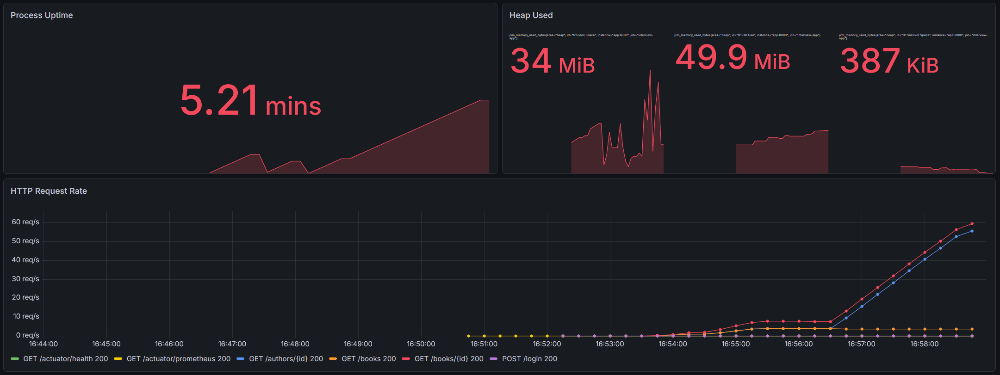
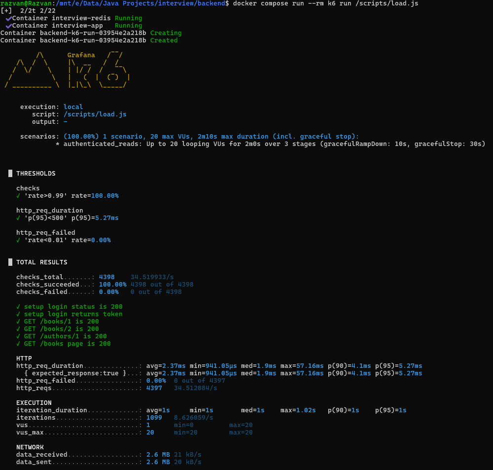
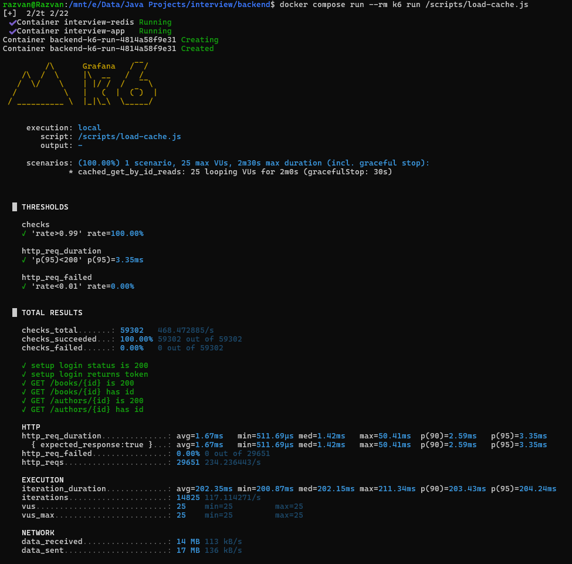

docs/README.load-testing.md

# Load testing guide

This project includes k6 scripts for exercising the API under realistic traffic patterns.

## Why load testing is included

The API was extended beyond CRUD to include:

- authentication
- pagination and sorting
- Redis caching
- Prometheus and Grafana metrics

k6 helps validate those runtime characteristics under load.

## Included scripts

The following scripts live under `testing/k6/`:

- `smoke.js` — quick validation that the application is reachable, login works, and a protected read succeeds
- `load.js` — broader authenticated read traffic against books and authors
- `cache-get-by-id.js` — repeated `getById` traffic intended to stress cache-backed reads

## Prerequisites

Make sure the application stack is already running:

```bash
docker compose up --build
```

Run the k6 commands in a separate terminal.

## Smoke test

Use this to validate that:

- the app is up
- login works
- a protected request succeeds

```bash
docker compose run --rm k6 run /scripts/smoke.js
```

## General read load

Use this to generate authenticated traffic across a few representative read endpoints.

```bash
docker compose run --rm k6 run /scripts/load.js
```

## Cache-focused load

Use this to repeatedly hit `getById` endpoints and observe cache-backed behavior.

```bash
docker compose run --rm k6 run /scripts/cache-get-by-id.js
```

## What to observe during load tests

While the scripts run, inspect:

- app logs
- Prometheus metrics
- Grafana dashboards
- Redis keys and TTLs

Typical things to watch:

- response times
- request throughput
- error rates
- cache-backed access patterns
- JVM memory behavior

## Result screenshots

### Grafana dashboard during load testing



### General load testing results



### Cache-focused load testing results



## Example workflow

1. Start the full stack with Docker Compose
2. Open Grafana and Prometheus
3. Run the smoke test
4. Run the general load test
5. Run the cache-focused test
6. Compare behavior across:
    - request latency
    - throughput
    - cache effectiveness
    - app resource usage

## Notes on credentials and target URL

The k6 container uses environment variables defined in `compose.yml`, for example:

- `BASE_URL`
- `USERNAME`
- `PASSWORD`

Because k6 runs inside the Docker Compose network, the API base URL is typically:

- `http://app:8080/api`

## Why the cache-focused script is useful

The cache-heavy script makes it easier to validate the value of Redis-backed caching on hot read paths by repeatedly
exercising stable IDs and observing:

- repeated response performance
- Redis key creation and reuse
- metric trends in Grafana

## Future extension ideas

The k6 setup could be extended with:

- write-heavy scenarios
- mixed read/write profiles
- staged warm-up versus measurement phases
- CI-triggered smoke tests
- threshold-based build failures